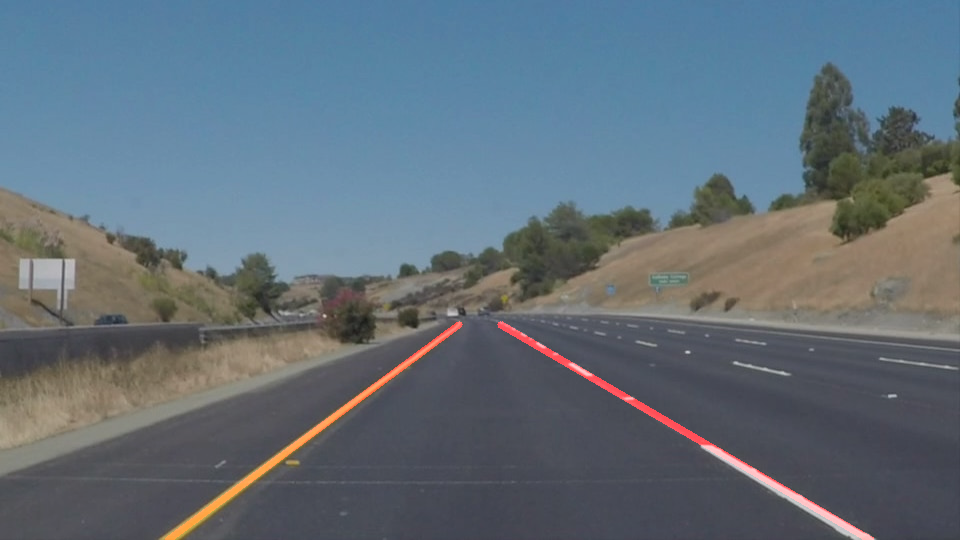
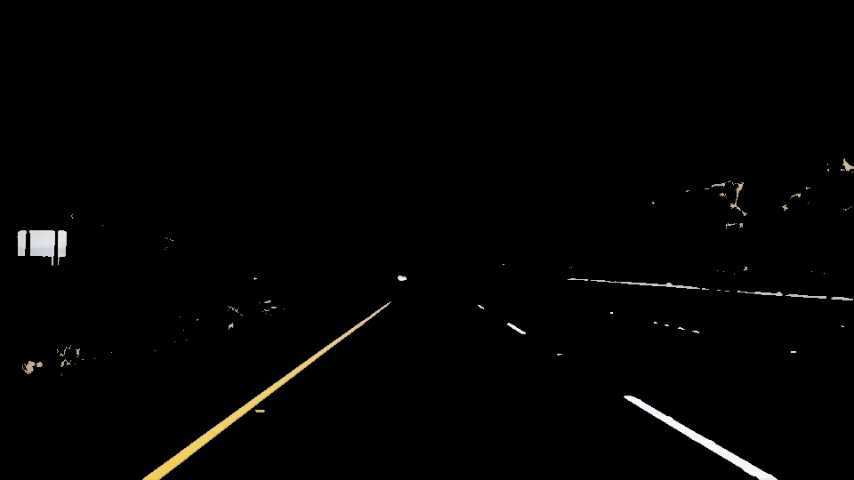
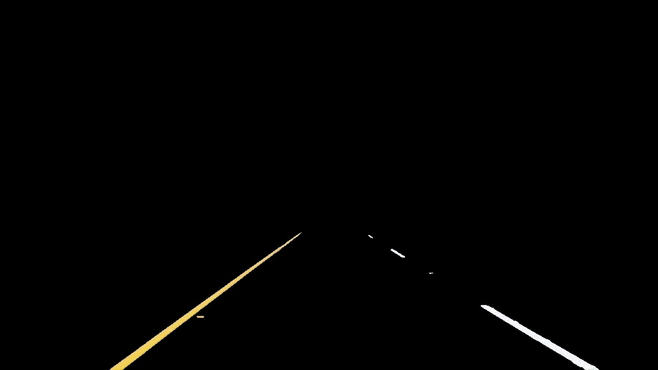
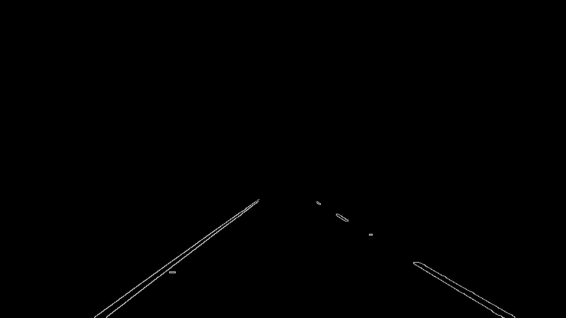
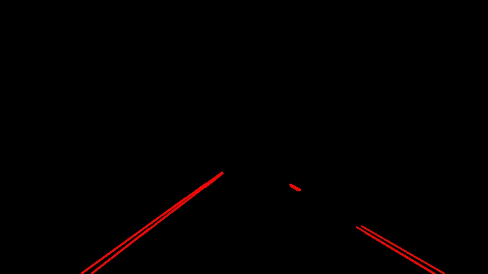

# **Finding Lane Lines on the Road** 

### Introduction

---
This is the first project in the Udacity Self-Driving Car Nanodegree program. In any autonomous car, lane detection is one of the basic requirements. This post goes through step by step process of the implementation using Python 3 and the OpenCV library.

### Goals

The goal of this project is to develop a software pipeline that finds lane lines on the road, first on still images and then on a videostream.
Below is a sample input and an expected output.
<p align="center">
  
  
</p>

---

### Reflection

### Description of the pipeline algorithm.

My pipeline consisted of the following steps:

**1: Convert the images to HSV color space.** It allows us to filter out colors much more easily by focusing on hue and saturation of the pixel. This makes handling of different lighting conditions easier. 

**2: Apply Gaussian blur** on the image to reduce noise.

**3: Create hsv color masks** for yellow and white and apply to the image to filter out anything that is not the color of the lanes.


```
def color_mask(img,hsv):
    lower_white = np.array([0/2,0,191]) #0,0,75%
    upper_white = np.array([359/2,25,255]) #359,10%,100%
    mask_white = cv2.inRange(hsv, lower_white, upper_white)

    lower_yellow = np.array([36/2,63,178]) #36,25%,70%
    upper_yellow = np.array([60/2,255,255])
    mask_yellow = cv2.inRange(hsv, lower_yellow, upper_yellow)

    mask = cv2.bitwise_or(mask_white,mask_yellow)
    maskedImage = cv2.bitwise_and(img,img, mask= mask)
    
    return maskedImage
```

The image will now contain only the areas that are needed, turning everything else to black. The output can be seen below:

<p align="center">
  
</p>

**4: Define a region of interest.** As seen in the masked image, there are false positives. But we are only interested in the area where we know the lanes are. This area can be established as a trapezoid on the bottom half of the image. Therefore, the next step will be to define a ROI, filtering out anything outside of it.

<p align="center">
  
</p>

**5: Edge detection using Canny Algorithm.** Now that the image mostly consists of clear lane lines, we will apply the Canny edge detector to identify all the edges in the image.

<p align="center">
  
</p>

**6: Draw Hough Lines.** In this step, we identify all the line segments in our image ROI. The lines identified will depend on the parameters passed into the **cv2.HoughLinesP()** algorithm. From these lines, we can extract two sets of x and y coodinates defining those lines. We will need these later to average out and extrapolate lines into single left and right lanes. 

<p align="center">
  
</p>


In order to draw a single line on the left and right lanes, I modified the draw_lines() function by performing the following steps:

**7: Separate line coordinates belonging to either left or right lanes.** For this, I declared a left and right boundary from the ROI region mentioned above. If a coordinate was closer to the left boundary than the one on the right, it was classified as the left lane and vice versa (Slope of the line can be used as well). 

**8: Average out the lines to make a single line.** For each line, we calculate its slope and the y-intercept take the mean/average of them. The mean slope and the mean intercept will form the new line. 

This works surpringly well in an image, but is too jittery in a videostream. For this reason, we use a moving average for the values of the last 20 frames. This not only helps with the smoothness, it also helps in a frame where no lines are detected.


```
def extrapolate(slope,inter,PREV_SLOPE_MEAN,PREV_INT_MEAN,window,index):
    slope_mean = np.mean(slope)
    inter_mean = np.mean(inter)

    # if averaging window not full, append mean values
    # otherwise replace the oldest value
    if (len(PREV_SLOPE_MEAN) != window): 
        PREV_SLOPE_MEAN.append(slope_mean)
        PREV_INT_MEAN.append(inter_mean)
    else:
        PREV_SLOPE_MEAN[index] = slope_mean
        PREV_INT_MEAN[index] = inter_mean

    # calculate new slope and intercept using moving average window
    new_slope = np.mean(PREV_SLOPE_MEAN)
    new_inter = np.mean(PREV_INT_MEAN)

    return new_slope,new_inter
```

**9: Calculate new sets of coordinates.** After getting the new slope and intercept from the above function, we use the equation **y = mx+c** to calculate new coordinates of the line stretching out from bottom of the image to the top of ROI.

```
def generate_points(mean_intercept,mean_slope,x):
    """
    generates to sets of x,y coordinates for averaged/extrapolated line.
    With the given slope and y-intercept, uses the equation:
        y = mx + c
    using x values from bottom of image to top of ROI
    """
    y1 = x*0.6  # roi top
    x1 = (y1 - mean_intercept)/mean_slope
    
    y2 = x      # roi bottom x
    x2 = (y2 - mean_intercept)/mean_slope

    x1 = int(round(x1))
    x2 = int(round(x2))
    y1 = int(round(y1))
    y2 = int(round(y2))

    return x1,y1,x2,y2
```

Below is the result of the averaged extrapolated line.

<p align="center">
  
</p>


### Potential shortcomings with the current pipeline


One potential shortcoming would be what would happen in poor driving conditions, such as snow, rain or poor lane markers.
There are also a lot of assumptions. Assuming certain types of lighting conditions, no shadows or obstruction, lanes must have high contrast with the road. 
Another shortcoming could be when there is road construction on highways, and new temporary lane markers are in place. Or also when the new lane markers and old lane markers are overlapping. They are easy to distinguish by a human eye but quite complex for computers.


### Possible improvements 

A possible improvement would be to use deeplearning to identify lanes. It would more efficient and reliable, but that depends on the model and how expansive the data set is.

